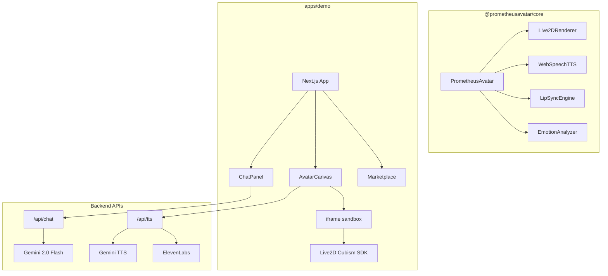

<p align="center">
  
</p>

<h1 align="center">Prometheus Avatar SDK</h1>

<p align="center">
  <strong>Give your AI an embodied avatar — in 3 lines of code.</strong>
</p>

<p align="center">
  Open-source SDK for driving Live2D & 3D avatars with LLM output.<br/>
  Lip-sync · Emotion expressions · TTS · Multi-language · Marketplace
</p>

<p align="center">
  <a href="https://prometheus-avatar.vercel.app">🌐 Live Demo</a> ·
  <a href="https://prometheus-avatar.vercel.app/marketplace">🛒 Marketplace</a> ·
  <a href="#quick-start">🚀 Quick Start</a> ·
  <a href="#中文文档">🇨🇳 中文</a>
</p>

<p align="center">
  <a href="https://www.npmjs.com/package/@prometheusavatar/core"></a>
  <a href="https://github.com/myths-labs/prometheus-avatar"></a>
  
  
  
</p>

---

## ✨ Features

| Feature | Description |
|---------|-------------|
| 🎭 **Live2D Avatars** | Render Cubism 2 & 4 models with auto-scaling and centering |
| 🗣️ **Text-to-Speech** | Multi-language TTS with auto language detection (EN/CN/JP/+) |
| 👄 **Lip Sync** | Real-time mouth animation synchronized with speech |
| 😊 **Emotion Engine** | Auto-detect emotions from text → expressions + motions |
| 🎨 **Marketplace** | Browse, buy, and sell avatar skins, voices, and effects |
| 🔌 **LLM Integration** | Connect to OpenAI / Claude / any LLM for AI conversations |
| 📦 **SDK** | Drop-in `@prometheusavatar/core` package for your own apps |

## 🎬 Demo

**[→ Try it live at prometheus-avatar.vercel.app](https://prometheus-avatar.vercel.app)**

- Select an avatar (Haru, Shizuku, Koharu)
- Type a message — the avatar speaks with lip sync
- Try different emotions: "I'm so happy!" vs "That's so sad..."

## 🚀 Quick Start

### Install

```bash
npm install @prometheusavatar/core
```

### Usage

```typescript
import { createAvatar } from '@prometheusavatar/core';

// Initialize — loads model, TTS, lip-sync, emotion
const avatar = await createAvatar({
  container: document.getElementById('avatar')!,
  modelUrl: 'https://cdn.jsdelivr.net/gh/guansss/pixi-live2d-display@0.4.0/test/assets/haru/haru_greeter_t03.model3.json',
});

// Avatar speaks with auto-detected emotion + lip-sync
await avatar.speak('Hello! I\'m your AI assistant. 😊');

// React to emotion changes
avatar.on('emotion:change', ({ result }) => {
  console.log(`Emotion: ${result.emotion} (${result.confidence})`);
});
```

## 🏗️ Architecture



```
prometheus-avatar/
├── packages/
│   ├── sdk/                  # @prometheusavatar/core
│   │   └── src/
│   │       ├── avatar.ts     # PrometheusAvatar orchestrator
│   │       ├── renderer.ts   # Live2D rendering via PIXI.js
│   │       ├── tts.ts        # Pluggable TTS engine
│   │       ├── lip-sync.ts   # Audio → mouth shape mapping
│   │       ├── emotion.ts    # Text → emotion detection
│   │       └── types.ts      # TypeScript interfaces
│   └── openclaw-plugin/      # OpenClaw marketplace integration
├── apps/
│   └── demo/                 # prometheus-avatar.vercel.app
│       ├── public/avatar.html # Live2D renderer (iframe)
│       └── src/
│           ├── components/   # AvatarCanvas, ChatPanel, VoiceSelector
│           └── app/
│               ├── api/chat/ # LLM endpoint (Gemini/Groq)
│               ├── api/tts/  # TTS endpoint (Gemini/ElevenLabs)
│               └── marketplace/ # Asset marketplace
└── README.md
```

## 🎭 Supported Models

| Model | Cubism | Source | License |
|-------|--------|--------|---------|
| Haru | 4 | Live2D Inc. | [Free Material License](https://www.live2d.com/en/terms/live2d-free-material-license-agreement/) |
| Shizuku | 2 | Live2D Inc. | Free Material License |
| Koharu | 2 | Community | Open Source |

> 💡 Any `.model.json` (Cubism 2) or `.model3.json` (Cubism 4) file works — load from URL or local path.

## 🛒 Marketplace

The [Avatar Marketplace](https://prometheus-avatar.vercel.app/marketplace) lets creators and AI agents sell:

- 🎨 **Skins** — Custom avatar appearances
- 🎤 **Voices** — Voice packs and TTS styles
- ✨ **Effects** — Particle effects, backgrounds, animations
- 🤖 **Personas** — Pre-configured personality + avatar bundles

Creators earn **80–90%** of every sale. AI agents can also create and sell assets.

## 🤝 Contributing

We welcome contributions! See [CONTRIBUTING.md](CONTRIBUTING.md) for guidelines.

```bash
# Clone & setup
git clone https://github.com/myths-labs/prometheus-avatar.git
cd prometheus-avatar
pnpm install

# Run demo locally
cd apps/demo
pnpm dev
```

## 📄 License

MIT © [Myths Labs](https://github.com/myths-labs)

---

<a id="中文文档"></a>

# 🇨🇳 中文文档

## Prometheus Avatar SDK

**让你的 AI 拥有一个有表情、会说话的虚拟化身 —— 只需 3 行代码。**

开源 SDK，用于驱动 Live2D 和 3D 虚拟形象。支持唇形同步、表情识别、文字转语音（TTS）、多语言、以及数字资产市场。

### ✨ 核心功能

- 🎭 **Live2D 虚拟形象** — 支持 Cubism 2 & 4，自动缩放居中
- 🗣️ **文字转语音** — 多语言 TTS，自动检测中文/英文/日文
- 👄 **唇形同步** — 说话时嘴巴实时跟随语音动
- 😊 **情感引擎** — 从文字自动检测情绪 → 触发表情 + 动作
- 🛒 **数字市场** — 浏览/购买/出售虚拟形象皮肤、声音、特效
- 🔌 **LLM 对接** — 接入 OpenAI / Claude / 任意大模型

### 🚀 快速开始

```bash
npm install @prometheusavatar/core
```

```typescript
import { createAvatar } from '@prometheusavatar/core';

const avatar = await createAvatar({
  container: document.getElementById('avatar')!,
  modelUrl: 'haru模型URL',
});

await avatar.speak('你好！我是你的AI助手。😊');
```

### 🌐 在线体验

**[→ prometheus-avatar.vercel.app](https://prometheus-avatar.vercel.app)**

### 📄 开源协议

MIT © [Myths Labs](https://github.com/myths-labs)

---

<p align="center">
  Built with 🔥 by <a href="https://github.com/myths-labs">Myths Labs</a>
</p>
